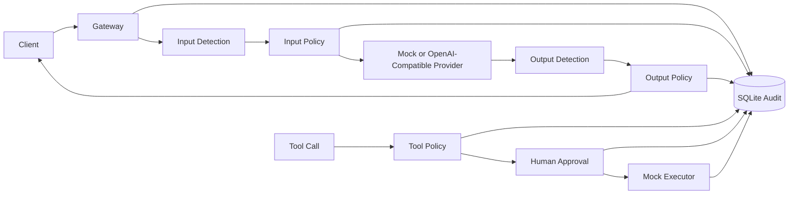

# AgentGuard

中文 | [English](README_EN.md)

**轻量级 AI Agent 安全控制网关与自动化安全评测平台。**

AgentGuard 位于 AI Agent / LLM 应用与模型、Tool 之间，通过统一 Pipeline 提供输入输出检测、策略决策、敏感信息保护、Tool Policy、Human Approval、安全审计与 Benchmark。项目用于降低 Prompt Injection（提示词注入）、敏感信息泄露和高风险工具调用带来的风险。

> 当前版本：**v1.0.0** · 可运行的安全工程原型

核心链路：`Input Guard → Policy → Provider → Output Guard`，以及 `Tool Policy → Human Approval → Mock Executor`。技术栈：Go 1.27、SQLite、Go Template、HTMX、Docker。


[▶ 查看 v1.0 历史完整演示](https://github.com/Bitesdust-3/agentguard/releases/tag/demo-v1.0.0)

## 项目简介

AgentGuard 将风险检测、策略决策和执行动作分离，以确定、可解释的规则处理 Chat 与 Tool 请求。默认 Mock Provider 和 Mock Tool Executor 无需外部 API Key，不执行真实 AI 推理或外部操作，便于本地验证完整安全链路。

关键 Audit 持久化采用 fail-closed：如果关键安全记录写入失败，当前 Provider 或 Tool 调用不会继续执行。

## 为什么需要 AgentGuard

LLM 应用不仅需要保护模型输入和输出，也需要约束 Agent 对外部工具的调用。AgentGuard 在应用与模型、Tool 之间建立统一控制点：Detector 负责发现风险，Policy 负责决定动作，Redactor 执行脱敏，Audit 记录最小化安全摘要。

## 核心能力

- **输入 / 输出安全检测**：PII、Secret、直接和基础间接 Prompt Injection 检测。
- **策略决策**：对输入和输出独立执行 `PASS`、`REDACT`、`BLOCK`。
- **敏感信息保护**：在进入 Provider 前或返回客户端前完成脱敏或阻断。
- **Tool 安全控制**：Tool Policy 对工具调用执行 `PASS`、`APPROVAL`、`BLOCK`。
- **Human Approval**：敏感外部操作需人工批准，拒绝或未批准时不得执行。
- **安全审计 Audit**：以 Request ID 关联 Detection、Policy、Tool、Approval 和 Audit Event，不持久化完整 Prompt、Provider Response 或敏感原值。
- **Security Benchmark**：使用相同 Detector 与 Policy 运行可复现评测，保留真实误报和漏报。
- **OpenAI-Compatible Provider**：支持一个可配置的 OpenAI-Compatible 上游 Provider，同时保留确定性的 Mock Provider。

## 系统架构



完整 Chat Pipeline：

```text
HTTP 校验
→ Input Detection
→ Input Policy
→ Input REDACT / BLOCK
→ Provider
→ Output Detection
→ Output Policy
→ Output REDACT / BLOCK
→ Response
```

## Dashboard

Dashboard 是基于现有 Audit 与 Benchmark 数据的高信息密度安全控制台，支持中文 / English 切换并在浏览器中保持语言选择。它提供：

- 安全态势总览与最近 Audit Event
- Security Events 筛选与安全摘要
- Tool Call、Approval 和执行状态追踪
- Request / Tool 关联时间线
- Benchmark 指标、分类表现与 Known Failures

主要页面：

- 安全总览：`/dashboard`
- 安全事件：`/dashboard/events`
- Tool 调用与审批：`/dashboard/tools`
- 安全评测：`/dashboard/benchmark`

Dashboard 仅改变展示方式，不定义核心实体、策略或状态枚举。

## 界面预览

截图仅使用虚构 Demo 数据和持久化的 Curated Benchmark v1 结果。

### 安全总览

集中展示请求决策、安全处理链路、最近 Audit Event 与 Tool Policy 状态。


### 安全事件

展示策略结果与安全摘要，不暴露原始请求内容。


### Tool 审批

展示 Tool Policy 的 `PASS`、`APPROVAL`、`BLOCK` 路径及执行状态。


### Benchmark

展示 Curated Benchmark v1 的核心指标、分类表现、复现信息和已知失败样本。


### Request 详情

关联 PII 检测、规则、`REDACT` 决策与 Audit 时间线，不保存原始敏感值。


### Prompt Injection 阻断

高风险 Prompt Injection 在访问 Provider 前被阻断并记录为 `BLOCK`。


## Demo

推荐按以下顺序验证完整安全链路：

1. Normal Chat → `PASS`
2. PII Input → `REDACT`
3. Prompt Injection → Provider 调用前 `BLOCK`
4. `weather.read` → `PASS` → Mock `EXECUTED`
5. `email.send` → `APPROVAL` → Human Approve → Mock `EXECUTED`
6. `file.delete` → `BLOCK`
7. 查看 Audit Dashboard 与 Benchmark Dashboard

当前界面以本页 GIF 和截图为准；Release 中的完整视频保留为 v1.0 历史演示。

## Security Benchmark

Curated Benchmark v1 包含 **266 条人工整理的虚构样本**，覆盖 7 类安全场景：Normal、PII、Secret、直接 Prompt Injection、间接 Prompt Injection、Tool Misuse 和 Approval Bypass。数据集中包含 hard negative 与边界样本。

复现参数：

- Seed：`42`
- Dataset Hash：`31e5fa5c5758fe207f0028ea7b0de2f5f553222236aa1ff34ad28f1cad16caa0`

当前默认 Policy 结果：

| 指标 | 结果 |
| --- | ---: |
| 样本数 | 266 |
| 类别数 | 7 |
| Accuracy | 91.1% |
| Precision | 95.0% |
| Recall | 85.4% |
| FPR | 4.0% |
| FNR | 14.6% |
| Decision Accuracy | 92.9% |
| TP / FP / TN / FN | 76 / 4 / 97 / 13 |
| Docker 验证运行额外延迟 | Average 23.408 µs；P50 25.328 µs；P95 56.565 µs |

延迟取决于运行主机，每次评测都会重新测量。Benchmark 保留真实误报和漏报，未针对测试集专门调参以追求满分。Known Failures 包括：部分改写后的直接攻击与 email / knowledge-base 间接通道可能漏报，部分防御性间接注入讨论可能误报，当前 Tool 规则尚未约束所有目标类型。

运行评测：

```bash
go run ./cmd/benchmark \
  -config configs/config.example.yaml \
  -dataset tests/benchmark/benchmark-v1.yaml \
  -seed 42
```

## 快速开始

要求：Go 1.27，以及供 `go-sqlite3` 使用的 C 编译器。

```bash
git clone https://github.com/Bitesdust-3/agentguard.git
cd agentguard
cp configs/config.example.yaml configs/config.local.yaml
go build -o bin/agentguard ./cmd/agentguard
./bin/agentguard -config configs/config.local.yaml
```

在另一个终端检查服务并发送 Mock Chat 请求：

```bash
curl --noproxy '*' --fail http://127.0.0.1:18080/health
curl --noproxy '*' --fail -X POST http://127.0.0.1:18080/v1/chat/completions \
  -H 'Content-Type: application/json' \
  -d '{"model":"mock-model","messages":[{"role":"user","content":"Hello AgentGuard"}]}'
```

同一可信网络中的其他设备可访问 `http://<SERVER_IP>:18080/dashboard`。v1.0 未实现 Authentication / RBAC，不应直接暴露到不可信网络。

运行使用虚构数据的端到端 Demo：

```bash
./scripts/demo.sh
```

如需更换端口：

```bash
AGENTGUARD_DEMO_URL=http://127.0.0.1:19090 ./scripts/demo.sh
```

Mock 模式不需要网络或 API Key。`configs/config.local.yaml`、`bin/` 与 `data/` 均已被 Git 忽略。

### Docker Compose

要求：Docker 与 Compose v2。

```bash
docker compose up --build
```

默认访问 `http://127.0.0.1:8080/dashboard`。Compose 只运行 AgentGuard，并将 SQLite 数据保存在 `agentguard-data` named volume。可通过 `AGENTGUARD_PORT` 修改主机端口：

```bash
AGENTGUARD_PORT=18080 docker compose up --build
```

停止服务但保留数据：

```bash
docker compose down
```

## systemd 常驻运行

完成本地构建后，使用公开模板 [`deploy/systemd/agentguard.service.example`](deploy/systemd/agentguard.service.example) 生成 systemd unit：

```bash
sed -e "s|<USER>|$(id -un)|g" \
  -e "s|<AGENTGUARD_DIR>|$PWD|g" \
  deploy/systemd/agentguard.service.example \
  | sudo tee /etc/systemd/system/agentguard.service >/dev/null
sudo systemctl daemon-reload
sudo systemctl enable --now agentguard
systemctl status agentguard --no-pager
curl --noproxy '*' --fail http://127.0.0.1:18080/health
```

修改本地代码后，[`scripts/restart-local.sh`](scripts/restart-local.sh) 可重新构建二进制、重启已安装的服务、显示状态并检查 Health。该脚本不会安装服务或编辑系统配置。

## 配置

复制 [`configs/config.example.yaml`](configs/config.example.yaml) 到已忽略的 `configs/config.local.yaml` 后再进行本地修改。公开示例监听 `0.0.0.0:18080`，Docker 使用独立的 [`configs/config.docker.yaml`](configs/config.docker.yaml)。

### Mock Provider

```yaml
provider:
  type: mock
  model: mock-model
  timeout_ms: 30000
  api_key_env: AGENTGUARD_PROVIDER_API_KEY
  base_url: ""
```

### OpenAI-Compatible Provider

只修改本地配置，并通过环境变量注入凭据：

```yaml
provider:
  type: openai_compatible
  base_url: https://api.example.invalid
  model: your-fixed-upstream-model
  timeout_ms: 30000
  api_key_env: AGENTGUARD_PROVIDER_API_KEY
```

```bash
export AGENTGUARD_PROVIDER_API_KEY='your-api-key'
./bin/agentguard -config configs/config.local.yaml
```

不要将真实 Key 写入 YAML、`.env.example`、源代码或 Git。AgentGuard 会将 `/v1/chat/completions` 追加到配置的服务 Base URL，固定使用配置的上游模型，并返回经过清理的上游错误。

## API

### Gateway 与 Health

- `GET /health`
- `POST /v1/chat/completions`：最小非流式文本子集，支持 `model` 和 `messages`（`system`、`user`、`assistant`）

### Tool 与 Approval

- `POST /api/tool-calls`
- `GET /api/tool-calls/{id}`
- `GET /api/approvals`
- `POST /api/approvals/{id}/approve`
- `POST /api/approvals/{id}/reject`

Tool 输入字段为 `tool_name`、`arguments`、`target_type`、`external`、`destructive` 和 `sensitive`。客户端不能提交自己的安全决策。

### Audit 与 Dashboard

- `GET /api/audit/events`：可选筛选参数为 `event_type`、`decision`、`detection_type`、`request_id`、`tool_call_id` 和 `limit`（1–100）
- `GET /dashboard`
- `GET /dashboard/events`
- `GET /dashboard/tools`
- `GET /dashboard/benchmark`

这些接口在 v1.0 中属于本地管理端点，没有 Authentication 层。

## 安全模型

- Detection 与 Policy Decision 是独立、确定性的组件。
- Score 和 Confidence 统一使用 `[0,1]`；稳定 Rule ID 用于解释决策。
- Input Policy 在 Provider 前执行；Output Policy 在数据返回客户端前执行。
- Tool Policy 和必需 Audit 持久化在 Mock Executor 前执行。
- Secret / PII Evidence、Prompt、Provider Response 与 Tool Arguments 不会被完整持久化。
- 关键 Audit 持久化采用 fail-closed，失败不会将已阻断操作变成允许操作。
- 未知 YAML 字段、不支持的 Provider / Action 和非法 Threshold 会明确失败。

## 技术栈

- Go 1.27、`net/http`、Go Template、HTMX
- SQLite 与 `go-sqlite3`
- YAML 配置
- Go Test 与 Race Detector
- Docker 与 Docker Compose
- GitHub Actions

## 项目结构

```text
.
├── cmd/                 # AgentGuard 与 Benchmark 入口
├── configs/             # 本地和 Docker 配置示例
├── deploy/systemd/      # 通用 systemd unit 模板
├── docs/                # 冻结的 v1 架构契约与展示素材
├── internal/            # App、Gateway、Detection、Policy、Provider、Tool、Audit、Benchmark、Web
├── scripts/             # 可复现 Demo 与本地服务重启脚本
├── tests/benchmark/     # 开发数据集与人工整理的虚构数据集
├── Dockerfile
├── docker-compose.yml
└── README.md
```

## 已知限制

- 当前 Detector 主要采用规则与特征评分，Prompt Injection 仍存在误报和漏报。
- 基础间接 Prompt Injection 覆盖有限；AgentGuard 不抓取或隔离外部文档，尚未提供 RAG 安全能力。
- Tool Executor 仅为 Mock，不执行真实 Tool 操作；尚未提供 MCP 与真实 Tool Adapter。
- 当前仅支持单个 OpenAI-Compatible Provider，不支持 Streaming、多模态、Tool / Function Calling 转发、多 Provider 路由、自动 Retry 或 Fallback。
- v1.0 没有多租户、Authentication、IAM 或 RBAC，不应直接暴露到不可信网络。
- SQLite 适合当前单节点原型规模。
- 如果未来真实 Tool Adapter 在最终 Audit 写入前已产生外部副作用，本地事务无法回滚该外部动作。

## Future Work

- 加强 Prompt Injection 与间接注入检测能力
- MCP 与其他 Agent Protocol 安全支持
- 真实 Tool Adapter
- Authentication、IAM 与 RBAC
- Streaming 与多模态支持
- 多 Provider 路由
- 面向真实外部副作用的 Idempotency 与 Outbox Pattern

以上内容不属于冻结的 v1.0 功能范围。

## 开发与验证

```bash
go test -count=1 ./...
go vet ./...
```

贡献流程参见 [`CONTRIBUTING.md`](CONTRIBUTING.md)。

## License

本项目使用 [MIT License](LICENSE)。
