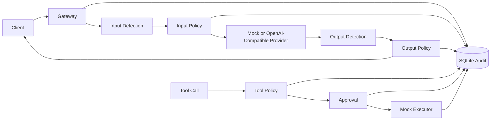
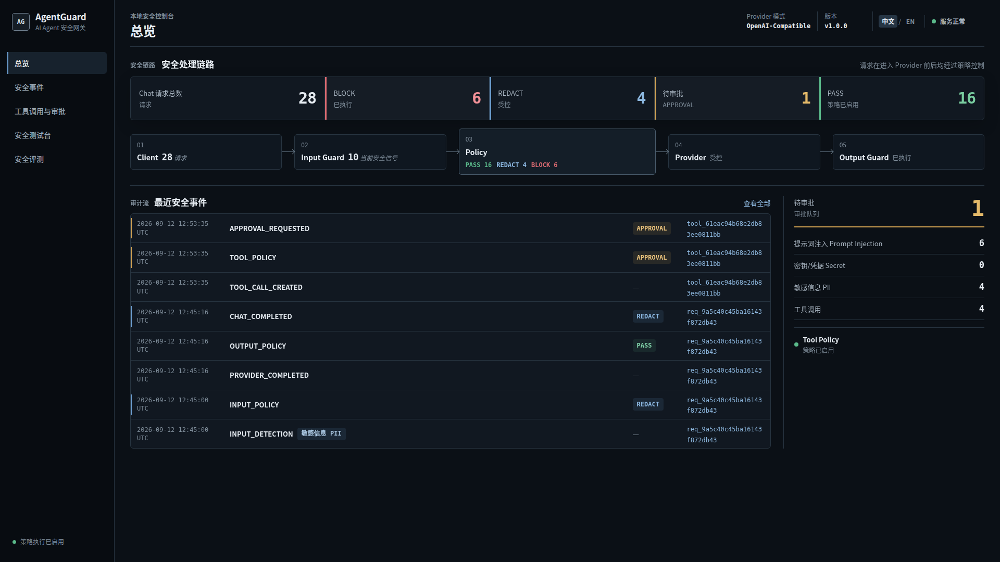
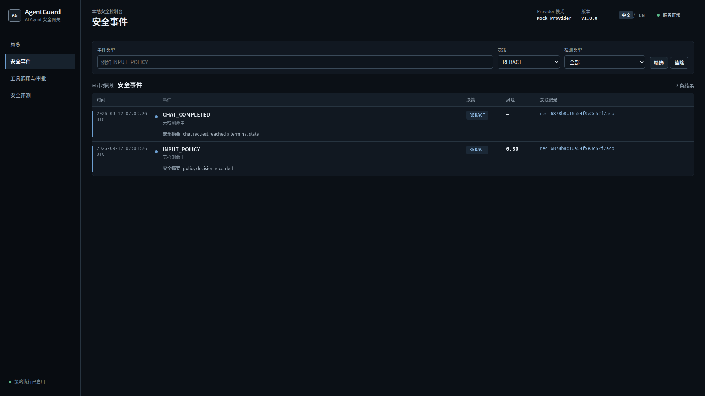
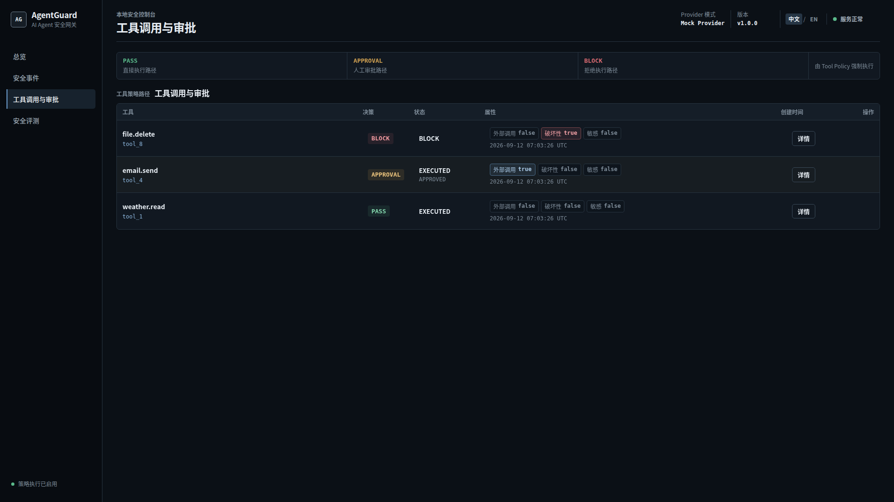
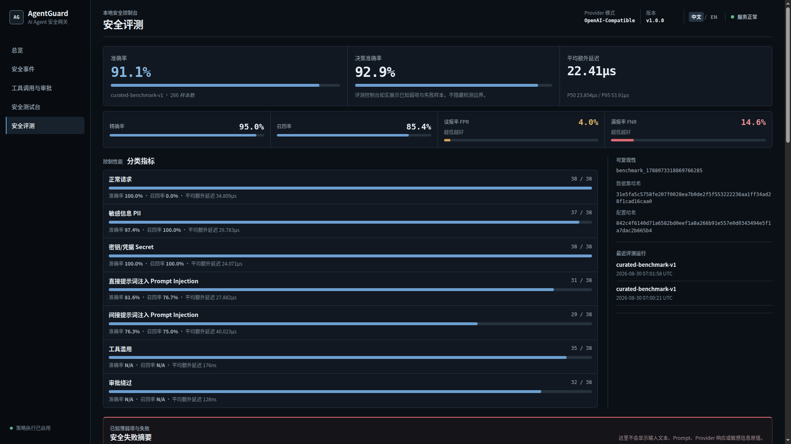
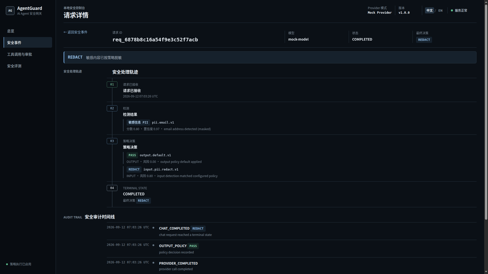
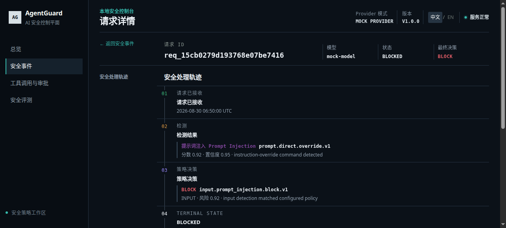
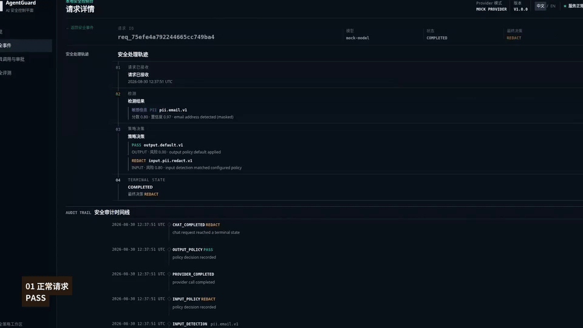

# AgentGuard

AgentGuard is an **AI Agent Security Gateway** (AI Agent 安全控制网关) and automated security evaluation platform. It places an explainable, auditable safety pipeline in front of OpenAI-compatible text chat and selected agent Tool Calls.

> **Status: v1.0.0**

AgentGuard v1.0.0 is a runnable security-engineering prototype with documented deployment limitations.

## Why AgentGuard

LLM applications need controls around both model traffic and agent actions. AgentGuard separates risk detection from policy decisions, minimizes sensitive audit data, and remains usable without an external model or API key.

## Core capabilities

- **Input Guard** — PII / Secret Detection and direct or basic indirect Prompt Injection Detection.
- **Policy Enforcement** — independent input and output `PASS`, `REDACT`, and `BLOCK` decisions.
- **Output Guard** — applies the same detection and policy model before Provider output reaches the client.
- **Tool Policy and Human Approval** — configuration-driven `PASS`, `APPROVAL`, and `BLOCK` decisions with a mock-only executor.
- **Audit Trail** — fail-closed SQLite persistence correlates requests, detections, policy decisions, Tool Calls, and approvals.
- **Security Benchmark** — reproducible evaluation using the same runtime Detector and Policy logic.
- **OpenAI-Compatible Provider** — one configurable upstream provider alongside the deterministic local Mock Provider.

The Mock Provider and Tool Executor perform no real AI inference or external action.

## Architecture



Detector components report what was found. Policy components decide what to do. Critical Audit failures stop subsequent Provider or Tool execution.

## Quick start

### Local Mock mode

Requirements: Go 1.27 and a C compiler for `go-sqlite3`.

```bash
go run ./cmd/agentguard -config configs/config.example.yaml
```

In another terminal:

```bash
curl --noproxy '*' --fail http://127.0.0.1:8080/health
curl --noproxy '*' --fail -X POST http://127.0.0.1:8080/v1/chat/completions \
  -H 'Content-Type: application/json' \
  -d '{"model":"mock-model","messages":[{"role":"user","content":"Hello AgentGuard"}]}'
```

Mock mode is the default and requires neither network access nor an API key. Runtime SQLite data is written under the ignored `data/` directory.

### Docker Compose

Requirements: Docker with Compose v2.

```bash
docker compose up --build
```

Open `http://127.0.0.1:8080/dashboard`. The Compose stack contains only AgentGuard and keeps SQLite data in the `agentguard-data` named volume. To use another host port, set `AGENTGUARD_PORT`, for example `AGENTGUARD_PORT=18080 docker compose up --build`.

Stop the service without deleting persisted data:

```bash
docker compose down
```

## Dashboard

- Overview: `/dashboard`
- Security events: `/dashboard/events`
- Tool Calls and approvals: `/dashboard/tools`
- Latest persisted Benchmark: `/dashboard/benchmark`

The Dashboard is a local administrative display over existing audit and benchmark data. Its lightweight Chinese/English switch defaults to Chinese and preserves the selected language in the browser; security decision values remain unchanged. It does not define core entities or policy behavior.

## Dashboard Preview

The screenshots below use only fictional demo data and the persisted Curated Benchmark v1 result.

### Overview

Security posture at a glance: request decisions, security flow, recent Audit events, and Tool Policy status.



### Security Events

The Audit event stream shows policy outcomes and safe summaries without exposing raw request content.



### Tool & Approval

Tool Policy makes PASS, APPROVAL, and BLOCK paths immediately visible alongside execution state.



### Benchmark

Curated Benchmark v1 presents security metrics, category performance, reproducibility metadata, and visible limitations.



### Request Detail

A PII REDACT request keeps the detection, rule, policy decision, and Audit trail correlated without storing the original value.



### Prompt Injection Block

A Prompt Injection request is stopped before Provider access and recorded as a BLOCK decision.



## Demo

See AgentGuard enforce REDACT, BLOCK and human approval across chat and tool workflows.



[▶ Watch Full Demo](https://github.com/Bitesdust-3/agentguard/releases/tag/demo-v1.0.0)

## Security Benchmark

Run the manually reviewed Curated Benchmark v1 with its fixed reproducibility seed:

```bash
go run ./cmd/benchmark \
  -config configs/config.example.yaml \
  -dataset tests/benchmark/benchmark-v1.yaml \
  -seed 42
```

The dataset contains **266 curated fictional samples** across seven evenly represented categories: normal, PII, Secret, direct Prompt Injection, indirect Prompt Injection, Tool misuse, and approval bypass. It includes hard negatives and boundary cases. Reproducibility uses **Seed 42** and canonical Dataset Hash `31e5fa5c5758fe207f0028ea7b0de2f5f553222236aa1ff34ad28f1cad16caa0`.

Current default-policy result:

| Metric | Result |
| --- | ---: |
| Samples | 266 |
| Accuracy | 0.911 |
| Precision | 0.950 |
| Recall | 0.854 |
| False Positive Rate | 0.040 |
| False Negative Rate | 0.146 |
| Decision Accuracy | 0.929 |
| Added Latency (Docker verification run) | Average 23.408 µs; P50 25.328 µs; P95 56.565 µs |

Latency depends on the host and is measured on each run. The result is not presented as state of the art. Known misses and false positives remain visible: some paraphrased direct attacks and email/knowledge-base indirect channels can be missed, some defensive indirect-injection text can be flagged, and current Tool rules do not constrain every target type.

## Demo flow

With AgentGuard running in Mock mode, run the fictional end-to-end demo:

```bash
./scripts/demo.sh
```

1. Normal Chat → `PASS`
2. PII Input → `REDACT`
3. Prompt Injection → `BLOCK` before Provider access
4. `weather.read` → `PASS` → mock `EXECUTED`
5. `email.send` → `APPROVAL` → Human Approve → mock `EXECUTED`
6. `file.delete` → `BLOCK`
7. Review the Audit Dashboard and Benchmark Dashboard

For a non-default port, use `AGENTGUARD_DEMO_URL=http://127.0.0.1:18080 ./scripts/demo.sh`. The script never selects the real provider and all payloads are artificial.

## Configuration

The local sample is [`configs/config.example.yaml`](configs/config.example.yaml); Docker uses [`configs/config.docker.yaml`](configs/config.docker.yaml) solely to listen on `0.0.0.0` and store SQLite data under `/app/data`.

### Mock Provider

```yaml
provider:
  type: mock
  model: mock-model
  timeout_ms: 30000
  api_key_env: AGENTGUARD_PROVIDER_API_KEY
  base_url: ""
```

### OpenAI-compatible Provider

Change only the local configuration and inject the credential through the environment:

```yaml
provider:
  type: openai_compatible
  base_url: https://api.example.invalid
  model: your-fixed-upstream-model
  timeout_ms: 30000
  api_key_env: AGENTGUARD_PROVIDER_API_KEY
```

```bash
export AGENTGUARD_PROVIDER_API_KEY='your-api-key'
go run ./cmd/agentguard -config /path/to/your-local-config.yaml
```

Never put a real key in YAML, `.env.example`, source code, or Git. AgentGuard appends `/v1/chat/completions` to the configured service base URL, always uses the configured upstream model, and returns sanitized upstream errors.

## API

### Gateway and health

- `GET /health`
- `POST /v1/chat/completions` — minimal non-streaming text subset with `model` and `messages` (`system`, `user`, `assistant`)

### Tool and approval

- `POST /api/tool-calls`
- `GET /api/tool-calls/{id}`
- `GET /api/approvals`
- `POST /api/approvals/{id}/approve`
- `POST /api/approvals/{id}/reject`

Tool input fields are `tool_name`, `arguments`, `target_type`, `external`, `destructive`, and `sensitive`. Clients cannot submit their own security decision.

### Audit and Dashboard

- `GET /api/audit/events` — optional filters: `event_type`, `decision`, `detection_type`, `request_id`, `tool_call_id`, and `limit` (1–100)
- `GET /dashboard`
- `GET /dashboard/events`
- `GET /dashboard/tools`
- `GET /dashboard/benchmark`

These are local-admin endpoints in v1.0 and have no authentication layer.

## Security model

- Detection and policy decisions are separate, deterministic components.
- Scores and confidence use the `[0,1]` range; stable rule IDs make decisions explainable.
- Input policy runs before Provider access; output policy runs before data reaches the client.
- Tool policy and required Audit persistence run before mock execution.
- Secret/PII evidence, prompts, Provider responses, and Tool arguments are not persisted in full.
- Critical Audit persistence is fail-closed. It must never turn a blocked operation into an allowed one.
- Unknown YAML fields, unsupported providers/actions, and invalid thresholds fail explicitly.

## Technology stack

- Go 1.27, `net/http`, Go Templates, and HTMX
- SQLite with `go-sqlite3`
- YAML configuration
- Go test tooling and race detector
- Docker and Docker Compose
- GitHub Actions

## Project structure

```text
.
├── cmd/                 # AgentGuard and Benchmark entry points
├── configs/             # Local and Docker-safe configuration examples
├── docs/                # Frozen v1 architecture contract
├── internal/            # App, gateway, detection, policy, provider, tools, audit, benchmark, web
├── scripts/             # Small reproducible demo
├── tests/benchmark/     # Development and curated fictional datasets
├── Dockerfile
├── docker-compose.yml
└── README.md
```

## Known limitations

- Prompt Injection defense is a rule-and-feature-scoring MVP and cannot cover every natural-language variant.
- Basic indirect Prompt Injection coverage is limited; AgentGuard does not fetch or isolate external documents.
- The Tool Executor is mock-only; it performs no real Tool action.
- There is no authentication or RBAC, so the service should not be exposed directly to an untrusted network.
- The real provider supports only non-streaming text Chat Completions. There is no streaming, multimodal input, Tool/Function Calling forwarding, multi-provider routing, automatic retry, or fallback.
- SQLite is a single-node store.
- A local transaction cannot roll back a real external side effect if a future real Tool adapter succeeds before a final Audit write fails.

## Future work

- Stronger Prompt Injection detection and more complete indirect-injection defenses
- MCP and other agent-protocol support
- Real Tool adapters
- Authentication and RBAC
- Streaming
- Multiple Provider support
- Idempotency and an Outbox pattern for real external side effects

These items are outside the frozen v1.0 feature scope.

## Development

```bash
go test -count=1 ./...
go vet ./...
```

See [`CONTRIBUTING.md`](CONTRIBUTING.md) for the concise contribution checklist.

## License

Distributed under the [MIT License](LICENSE).
